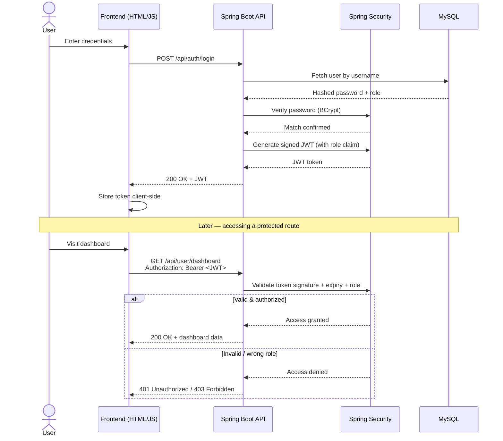

<div align="center">

# 🔐 Secure User Management System

### A production-style authentication & authorization system built with Spring Boot, Spring Security, JWT & MySQL

[](https://www.oracle.com/java/)
[](https://spring.io/projects/spring-boot)
[](https://spring.io/projects/spring-security)
[](https://jwt.io/)
[](https://www.mysql.com/)
[](https://developer.mozilla.org/en-US/docs/Web/JavaScript)

[](LICENSE)
[](CONTRIBUTING.md)
[](../../stargazers)

**Register → Login → Get a JWT → Access role-protected dashboards. That's the whole ride.**

[Features](#-features) • [Tech Stack](#-tech-stack) • [Getting Started](#️-getting-started) • [API Reference](#-api-reference) • [Screenshots](#-screenshots) • [Roadmap](#-roadmap)

</div>

---

## ✨ Why this project?

Most "user management" demos stop at login. This one goes further — real password hashing, stateless JWT auth, and actual role separation between `USER` and `ADMIN`, wired end-to-end from a MySQL table to a plain HTML/CSS/JS frontend with zero frameworks. If you're learning Spring Security or want a clean starter for your next SaaS side project, this is built to be forked.

## 🚀 Features

| | Feature | Description |
|---|---|---|
| 📝 | **User Registration & Login** | Clean, validated auth flows out of the box |
| 🔑 | **Password Encryption** | BCrypt hashing — passwords are never stored in plain text |
| 🪪 | **JWT Authentication** | Stateless, scalable token-based sessions |
| 🛡️ | **Role-Based Access Control** | Separate `USER` and `ADMIN` permissions |
| 🔒 | **Protected REST APIs** | Endpoints locked down via Spring Security filters |
| 📊 | **User Dashboard** | A logged-in space for regular users |
| 👑 | **Admin Dashboard** | Elevated view for admin-only actions |
| 🚪 | **Secure Logout** | Proper token invalidation on the client |
| 🌐 | **CORS Enabled** | Frontend and backend talk to each other cleanly |

<details>
<summary><b>💡 Curious how the JWT flow works under the hood?</b></summary>
<br>

```
1. User submits credentials → POST /api/auth/login
2. Backend verifies password (BCrypt) against MySQL record
3. On success → Spring Security generates a signed JWT
4. Token returned to frontend, stored client-side
5. Every protected request → Authorization: Bearer <token>
6. Spring Security filter validates signature + expiry + role
7. Access granted (or 401/403 if invalid/insufficient role)
```

</details>

---

## 🧭 Architecture: Auth Flow



> Renders natively on GitHub — no image export needed. If it doesn't render in your viewer, any [Mermaid Live Editor](https://mermaid.live) will preview it instantly.

---

## 🛠 Tech Stack

<table>
<tr>
<td valign="top" width="50%">

### Backend
- ☕ **Java 17**
- 🍃 **Spring Boot**
- 🔐 **Spring Security**
- 🪪 **JWT (JSON Web Tokens)**
- 🐬 **MySQL**
- 🗃️ **JPA / Hibernate**

</td>
<td valign="top" width="50%">

### Frontend
- 🧱 **HTML5**
- 🎨 **CSS3**
- ⚡ **JavaScript (Fetch API)**
- 🚫 No frameworks — deliberately lightweight

</td>
</tr>
</table>

---

## 📂 Project Structure

```
Secure-User-Management-System
├── backend
│   └── usermanagement
│       ├── src/main/java/...          # Controllers, Services, Security config
│       └── src/main/resources/
│           └── application.properties  # DB + JWT config
├── frontend
│   ├── login.html
│   ├── register.html
│   ├── user.html
│   └── admin.html
└── README.md
```

---

## ▶️ Getting Started

### ✅ Prerequisites
- Java 17+
- Maven
- MySQL running locally (or update the connection string)

### 1️⃣ Clone the repo
```bash
git clone https://github.com/prateek02221/Secure-User-Management-System.git
cd Secure-User-Management-System
```

### 2️⃣ Configure the database
Update `backend/usermanagement/src/main/resources/application.properties`:
```properties
spring.datasource.url=jdbc:mysql://localhost:3306/user_management
spring.datasource.username=root
spring.datasource.password=your_password
jwt.secret=your_jwt_secret_key
```

### 3️⃣ Run the backend
```bash
cd backend/usermanagement
mvn spring-boot:run
```
The API will be live at `http://localhost:8080` 🎉

### 4️⃣ Launch the frontend
Simply open `frontend/login.html` in your browser (or serve the `frontend` folder with any static server / Live Server extension).

---

## 📡 API Reference

| Method | Endpoint | Access | Description |
|--------|----------|--------|-------------|
| `POST` | `/api/auth/register` | Public | Register a new user |
| `POST` | `/api/auth/login` | Public | Authenticate & receive JWT |
| `GET`  | `/api/user/dashboard` | 🔒 USER | User-only protected data |
| `GET`  | `/api/admin/dashboard` | 🔒 ADMIN | Admin-only protected data |
| `POST` | `/api/auth/logout` | 🔒 Authenticated | Invalidate current session |

> All protected routes require a header: `Authorization: Bearer <your_jwt_token>`

---

---

## 🗺 Roadmap

- [ ] Refresh token support
- [ ] Email verification on registration
- [ ] Forgot/reset password flow
- [ ] Rate limiting on auth endpoints
- [ ] Dockerize backend + MySQL
- [ ] Swagger/OpenAPI docs

Have an idea? Open an issue or PR — contributions welcome!

---

## 🤝 Contributing

1. Fork the repo
2. Create your feature branch (`git checkout -b feature/amazing-thing`)
3. Commit your changes (`git commit -m 'Add amazing thing'`)
4. Push to the branch (`git push origin feature/amazing-thing`)
5. Open a Pull Request

---

## 📜 License

This project is licensed under the **MIT License** — feel free to use it for learning, portfolios, or your own builds.

---

<div align="center">

**Built with ☕, 🔐, and a healthy respect for BCrypt**

If this helped you, consider giving it a ⭐ — it really does help!

</div>
